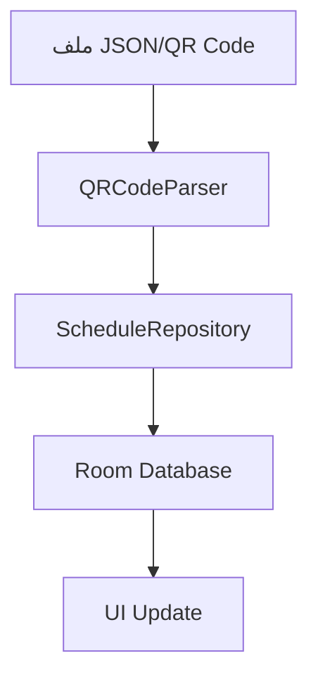
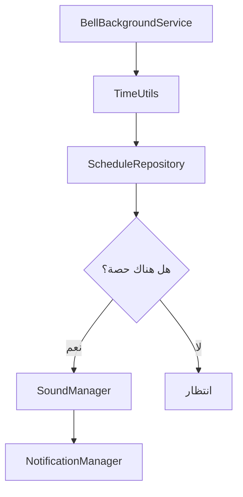
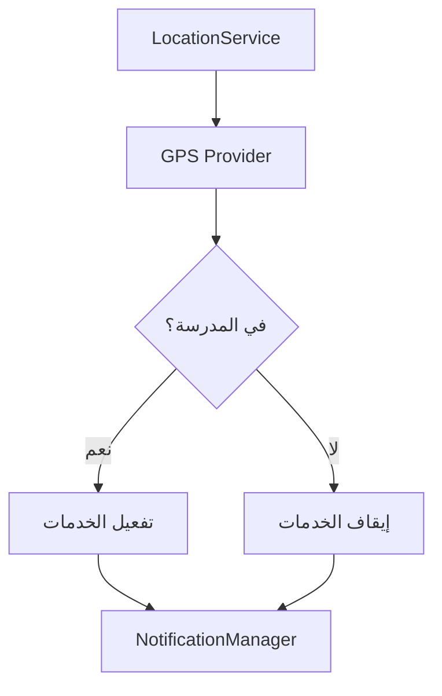

# التوثيق التقني - Bell App

## 📋 نظرة عامة

هذا الدليل يوضح البنية التقنية لتطبيق Bell والواجهات البرمجية الداخلية.

## 🏗️ هيكل المشروع

### الحزم الرئيسية

```
com.mo.bell/
├── audio/              # إدارة الأصوات والتنبيهات
├── data/               # طبقة البيانات
│   ├── database/       # قاعدة البيانات Room
│   ├── models/         # نماذج البيانات
│   └── repository/     # مستودعات البيانات
├── location/           # خدمات الموقع الجغرافي
├── notifications/      # إدارة الإشعارات
├── receiver/           # مستقبلات البث
├── service/            # الخدمات في الخلفية
├── ui/                 # واجهات المستخدم
│   ├── main/           # الشاشة الرئيسية
│   ├── schedule/       # شاشة الجدول
│   ├── settings/       # شاشة الإعدادات
│   ├── sound/          # إعدادات الصوت
│   └── location/       # إعدادات الموقع
└── utils/              # الأدوات المساعدة
```

## 🗄️ قاعدة البيانات

### الجداول

#### 1. Teacher (المدرسين)
```sql
CREATE TABLE teacher (
    id INTEGER PRIMARY KEY AUTOINCREMENT,
    name TEXT NOT NULL,
    subject TEXT NOT NULL,
    email TEXT,
    phone TEXT,
    created_at INTEGER NOT NULL,
    updated_at INTEGER NOT NULL
);
```

#### 2. Schedule (الجداول)
```sql
CREATE TABLE schedule (
    id INTEGER PRIMARY KEY AUTOINCREMENT,
    teacher_id INTEGER NOT NULL,
    day_of_week INTEGER NOT NULL,
    class_name TEXT NOT NULL,
    subject_name TEXT NOT NULL,
    teacher_name TEXT NOT NULL,
    start_time TEXT NOT NULL,
    end_time TEXT NOT NULL,
    created_at INTEGER NOT NULL,
    FOREIGN KEY (teacher_id) REFERENCES teacher(id)
);
```

#### 3. Settings (الإعدادات)
```sql
CREATE TABLE settings (
    id INTEGER PRIMARY KEY AUTOINCREMENT,
    key TEXT UNIQUE NOT NULL,
    value TEXT NOT NULL,
    type TEXT NOT NULL,
    updated_at INTEGER NOT NULL
);
```

#### 4. Location (الموقع)
```sql
CREATE TABLE location (
    id INTEGER PRIMARY KEY AUTOINCREMENT,
    name TEXT NOT NULL,
    latitude REAL NOT NULL,
    longitude REAL NOT NULL,
    radius INTEGER NOT NULL,
    is_school_location INTEGER NOT NULL DEFAULT 0,
    created_at INTEGER NOT NULL
);
```

### العلاقات
- `Schedule.teacher_id` → `Teacher.id` (Many-to-One)

## 📡 واجهات البرمجة الداخلية

### 1. ScheduleRepository

```kotlin
interface ScheduleRepository {
    suspend fun getAllSchedules(): List<Schedule>
    suspend fun getScheduleForDay(dayOfWeek: Int): List<Schedule>
    suspend fun getCurrentClass(): Schedule?
    suspend fun getNextClass(): Schedule?
    suspend fun insertSchedule(schedule: Schedule): Long
    suspend fun updateSchedule(schedule: Schedule)
    suspend fun deleteSchedule(schedule: Schedule)
    suspend fun deleteAllSchedules()
    suspend fun importFromJson(jsonData: String): Boolean
    suspend fun exportToJson(): String
}
```

### 2. SoundManager

```kotlin
interface SoundManager {
    fun playSound(soundType: SoundType, duration: Int)
    fun stopSound()
    fun setVolume(volume: Float)
    fun getAvailableSounds(): List<SoundType>
    fun testSound(soundType: SoundType)
    fun isPlaying(): Boolean
}

enum class SoundType {
    BELL_CLASSIC,
    BELL_MODERN,
    CHIME_SOFT,
    CHIME_LOUD
}
```

### 3. LocationService

```kotlin
interface LocationService {
    fun startLocationMonitoring()
    fun stopLocationMonitoring()
    fun getCurrentLocation(): Location?
    fun isInSchoolArea(): Boolean
    fun setSchoolLocation(latitude: Double, longitude: Double, radius: Int)
    fun getDistanceToSchool(): Float
}
```

### 4. NotificationManager

```kotlin
interface NotificationManager {
    fun showClassStartNotification(className: String, subject: String)
    fun showClassEndNotification(className: String, subject: String)
    fun showNextClassNotification(className: String, timeRemaining: String)
    fun showLocationNotification(isInSchool: Boolean)
    fun cancelAllNotifications()
    fun createNotificationChannels()
}
```

## 🔄 تدفق البيانات

### 1. استيراد الجدول



### 2. مراقبة الوقت



### 3. مراقبة الموقع



## 🔧 إعدادات التطبيق

### مفاتيح الإعدادات

```kotlin
object SettingsKeys {
    const val BACKGROUND_SERVICE_ENABLED = "background_service_enabled"
    const val MANUAL_MODE_ENABLED = "manual_mode_enabled"
    const val DARK_MODE_ENABLED = "dark_mode_enabled"
    const val SOUND_ENABLED = "sound_enabled"
    const val SOUND_TYPE = "sound_type"
    const val SOUND_VOLUME = "sound_volume"
    const val SOUND_DURATION = "sound_duration"
    const val LOCATION_ENABLED = "location_enabled"
    const val SCHOOL_LATITUDE = "school_latitude"
    const val SCHOOL_LONGITUDE = "school_longitude"
    const val ACTIVATION_RADIUS = "activation_radius"
}
```

### القيم الافتراضية

```kotlin
object DefaultSettings {
    const val BACKGROUND_SERVICE_ENABLED = true
    const val MANUAL_MODE_ENABLED = false
    const val DARK_MODE_ENABLED = false
    const val SOUND_ENABLED = true
    const val SOUND_TYPE = "BELL_CLASSIC"
    const val SOUND_VOLUME = 0.8f
    const val SOUND_DURATION = 5
    const val LOCATION_ENABLED = false
    const val ACTIVATION_RADIUS = 100
}
```

## 📱 دورة حياة التطبيق

### 1. بدء التطبيق

```kotlin
class BellApplication : Application() {
    override fun onCreate() {
        super.onCreate()
        
        // تهيئة Hilt
        // إنشاء قنوات الإشعارات
        // بدء الخدمات المطلوبة
        // تحميل الإعدادات
    }
}
```

### 2. الخدمة في الخلفية

```kotlin
class BellBackgroundService : Service() {
    
    private val timeCheckInterval = 30_000L // 30 ثانية
    
    override fun onStartCommand(intent: Intent?, flags: Int, startId: Int): Int {
        when (intent?.action) {
            ACTION_START_SERVICE -> startMonitoring()
            ACTION_STOP_SERVICE -> stopSelf()
        }
        return START_STICKY
    }
    
    private fun startMonitoring() {
        // مراقبة الوقت كل 30 ثانية
        // فحص الحصة الحالية والقادمة
        // تشغيل الأصوات عند الحاجة
        // إرسال الإشعارات
    }
}
```

## 🔐 الأمان والصلاحيات

### الصلاحيات المطلوبة

```xml
<!-- الموقع الجغرافي -->
<uses-permission android:name="android.permission.ACCESS_FINE_LOCATION" />
<uses-permission android:name="android.permission.ACCESS_COARSE_LOCATION" />

<!-- العمل في الخلفية -->
<uses-permission android:name="android.permission.FOREGROUND_SERVICE" />
<uses-permission android:name="android.permission.WAKE_LOCK" />

<!-- الإشعارات -->
<uses-permission android:name="android.permission.POST_NOTIFICATIONS" />

<!-- التخزين -->
<uses-permission android:name="android.permission.READ_EXTERNAL_STORAGE" />

<!-- إعادة التشغيل -->
<uses-permission android:name="android.permission.RECEIVE_BOOT_COMPLETED" />
```

### حماية البيانات

- تشفير قاعدة البيانات المحلية
- عدم تخزين بيانات حساسة
- تنظيف البيانات المؤقتة
- احترام خصوصية الموقع

## 🧪 الاختبار

### اختبارات الوحدة

```kotlin
@Test
fun `should calculate correct duration between times`() {
    // Given
    val startTime = "08:00"
    val endTime = "08:45"
    
    // When
    val duration = TimeUtils.calculateDurationMinutes(startTime, endTime)
    
    // Then
    assertEquals(45, duration)
}
```

### اختبارات قاعدة البيانات

```kotlin
@Test
fun `should insert and retrieve schedule correctly`() = runTest {
    // Given
    val schedule = Schedule(
        teacherId = 1,
        dayOfWeek = 1,
        className = "الصف الأول أ",
        subjectName = "الرياضيات",
        teacherName = "أحمد محمد",
        startTime = "08:00",
        endTime = "08:45"
    )
    
    // When
    val id = scheduleDao.insertSchedule(schedule)
    val retrieved = scheduleDao.getScheduleById(id)
    
    // Then
    assertNotNull(retrieved)
    assertEquals(schedule.className, retrieved?.className)
}
```

## 📊 مراقبة الأداء

### مؤشرات الأداء الرئيسية

- استهلاك البطارية
- استخدام الذاكرة
- دقة مراقبة الموقع
- سرعة الاستجابة
- معدل نجاح التنبيهات

### أدوات المراقبة

- Android Profiler
- Battery Historian
- Memory Analyzer
- Network Monitor

## 🔄 التحديثات المستقبلية

### v1.1.0
- دعم التقويم الهجري
- تكامل مع Google Calendar
- إشعارات أكثر تفصيلاً

### v1.2.0
- دعم أصوات مخصصة
- تطبيق ويب مصاحب
- مزامنة السحابة

---

**للمزيد من المعلومات التقنية، راجع الكود المصدري أو تواصل مع فريق التطوير.**

